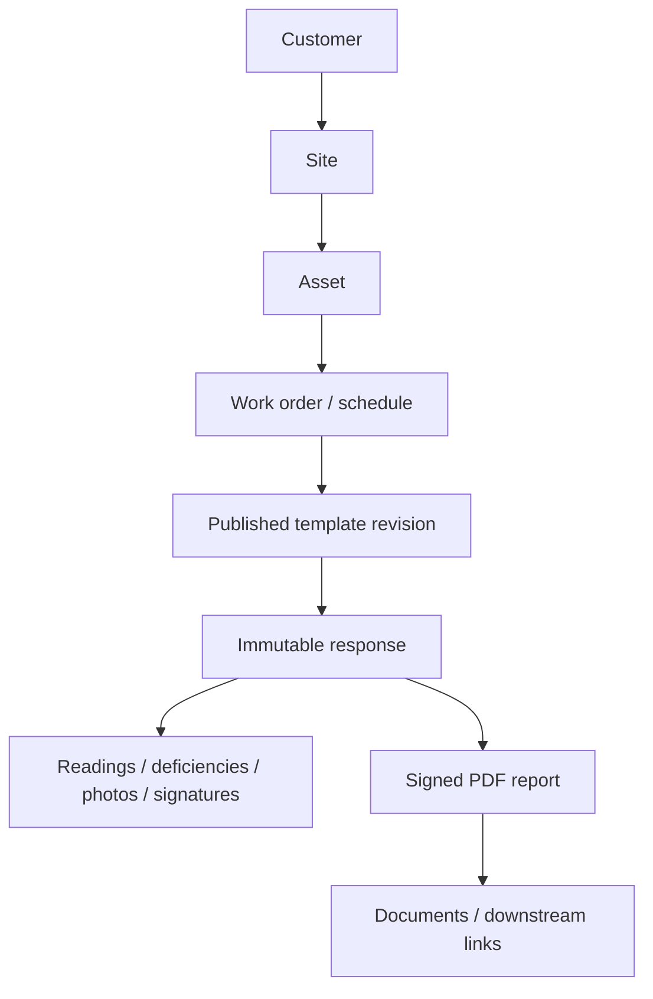

# Voltcore FieldOps — Expansion & Efficiency Roadmap

## Purpose

Voltcore began as an offline-first standby-generator inspection and maintenance
application. The FieldOps roadmap expands that foundation into a reusable
field-service and compliance platform for customers, sites, assets, work
orders, inspections, maintenance, evidence, and signed reports.

Generator workflows remain the first supported vertical and the regression
baseline. Phase 3 is an additive migration to a versioned template engine; it
does not delete or rewrite legacy generator records or reports.

## Product core



## Delivery status — 24 August 2026

| Phase | Status | Delivered scope | Remaining gate |
| --- | --- | --- | --- |
| Phase 1 | Complete | Tenant-safe scheduling and generic asset vocabulary. | Environment-by-environment operational verification only. |
| Phase 2 | Complete / rollout validation | Customer/site directory, generic asset registration, work-order lifecycle, schedule details, audit events, dispatch views, and maintenance handoff. | Continue real-user rollout verification. |
| Phase 3 | Certification / pilot readiness | Versioned templates, management UI, renderer, offline response lifecycle, generator packs/adapters, generic PDFs, cross-platform Documents integration, durable report links, and technician execution runtime. | Merge final certification PR, apply index hardening, install generator templates in the pilot tenant, run the manual offline/revision/PDF parity pilot, then enable the build flag only for that pilot. |

## Reliability correction — schedule deletion consistency

A schedule task DELETE could race an already-running remote schedule GET. The
remote response then saw the local Hive row missing and rehydrated the deleted
task, causing it to reappear in Upcoming, Dashboard/recent activity, counters,
calendar/list/timeline views, or task detail.

PR #52 fixed this at the shared repository boundary:

- a deletion tombstone is recorded before the first delete `await`;
- stale remote hydration skips tombstoned task IDs;
- schedule loads and direct task lookup filter tombstoned IDs;
- an explicit save is the only operation that clears the tombstone and may
  intentionally recreate that ID;
- Hive deletion, durable sync deletion, and reminder cancellation are preserved.

This is intentionally a repository rule rather than a per-widget workaround so
all schedule-driven views receive the same consistent state.

## Phase 1 — Secure foundation and generic asset vocabulary

Delivered:

- tenant-scoped scheduling and authenticated Data API access;
- shared equipment records capable of representing non-generator assets;
- asset type and metadata mapping;
- local-first persistence and durable synchronization conventions.

## Phase 2 — Sites, assets, and work orders

Delivered:

- customer-to-site ownership and directory UI;
- site-aware generic asset registration and reassignment;
- QR/barcode search and asset history;
- work-order create/edit/list/detail and one-way lifecycle transitions;
- technician assignment, priority, schedule, customer/site/asset links;
- database-owned audit events;
- schedule-task detail routing before source-record navigation;
- operational workload summary;
- inspection-to-maintenance scheduling handoff.

Legacy generator maintenance records remain available under Maintenance Records
and Archived Maintenance.

## Phase 3 — Template engine and generator migration

### Objective

Replace generator-specific form/PDF branching with a versioned, tenant-safe
engine while preserving every existing generator record/report throughout a
controlled cutover.

### Delivered architecture

#### 1. Template contract and database foundation

Delivered tables and relationships:

- `form_templates`
- `form_template_revisions`
- `form_template_sections`
- `form_template_fields`
- `form_template_field_options`
- `form_responses`
- `form_response_report_artifacts`

Responses store the exact template revision used to collect them. Completed
responses are immutable. Report artifacts derive their tenant/revision and
customer/site/asset/work-order/inspection/maintenance links from the completed
response in the database rather than trusting client-supplied relationship IDs.

The report-artifact migration is deployed to the connected VoltCore Supabase
project. RLS is enabled; the response-link trigger exists; authenticated SELECT
and INSERT tenant policies were verified.

#### 2. Template management

Delivered:

- role-gated template list and revision history;
- clone-as-draft;
- draft editing of sections, fields, options, validation, visibility, and order;
- atomic draft graph save;
- atomic publish with replacement archival;
- draft archival;
- explicit, non-destructive installation of the built-in generator inspection
  and maintenance template pack for the active tenant.

Template management is available to supervisor, dispatcher, and admin roles.
Supabase RLS remains authoritative; UI role gating is only an affordance.

#### 3. Generic runtime renderer

Supported field types:

- text
- number
- reading with units
- date
- select
- boolean
- checklist
- photo
- signature

The runtime supports conditional section/field visibility, required/type/range
validation, read-only rendering, and pluggable photo/signature capture.

#### 4. Offline response lifecycle

Delivered:

- local-first response persistence;
- durable sync enqueue;
- debounced autosave;
- serialized saves and retryable save errors;
- exact template-revision pinning;
- validation before completion;
- hard mutation lock after completion;
- exact-revision Hive definition cache wired into the normal Hive lifecycle;
- tests proving offline fallback never substitutes another/newer revision;
- close/reopen cache regression coverage.

#### 5. Generator template pack and legacy migration adapters

Delivered canonical packs:

- `generator-inspection`
- `generator-maintenance`

Legacy adapters:

- preserve directly equivalent values under stable semantic field keys;
- preserve the complete JSON-safe legacy payload under `_legacyPayload`;
- retain source/provenance metadata;
- document legacy boolean ambiguity rather than guessing whether an old `false`
  was explicit or a model default;
- retain inspection load-test and photo collections as explicitly linked legacy
  evidence rather than pretending they were scalar form fields;
- preserve draft/completed state and revision provenance.

Certification tests verify that every template field retains a canonical or
legacy evidence source and that migrated generator inspection responses render
through the generic report path.

#### 6. Generic PDF and Documents path

Delivered:

- exact revision check before report rendering;
- Noto Sans assets and US Letter multi-page output;
- response metadata, grade, deficiencies, sections, labels, readings, units,
  photos/signatures, pagination, and legacy provenance;
- native PDF storage using the existing managed PDF tree;
- web PDF persistence in `WebFileStore`/IndexedDB;
- Documents discovery, open, share, and delete for native and web;
- durable file upload enqueue;
- immutable server-side report metadata with downstream lookup indexes.

The existing generator PDFs remain available as the pilot comparison baseline.

#### 7. Technician execution runtime and rollback

Delivered route:

`/field-forms/:templateSlug`

For new work the page resolves the current published definition once, creates a
local-first draft, and pins that revision. Reopened work resolves the response's
exact stored revision. Completion validates, persists, locks the response, and
generates the template report.

The route is default-disabled and controlled at build time:

```bash
flutter run \
  --dart-define=VOLTCORE_GENERATOR_TEMPLATE_PILOT=true
```

or for a web build:

```bash
flutter build web \
  --dart-define=VOLTCORE_GENERATOR_TEMPLATE_PILOT=true
```

Without the define, the pilot route is not registered and all legacy generator
inspection/maintenance routes continue unchanged. This is the Phase 3 rollback
switch.

### Phase 3 PR sequence

Major merged increments:

- #46 — management write boundary and atomic revision RPCs
- #47 — role-gated management UI
- #48 — draft definition editor
- #49 — generic runtime renderer
- #50 — offline autosave and completion locking
- #51 — generator template pack and legacy adapters
- #53 — generic template PDF renderer
- #54 — cross-platform report persistence and Documents integration
- #55 — durable report artifact links
- #56 — technician runtime pilot and exact-revision cache certification

PR #52 was the independent schedule-deletion consistency repair performed before
continuing Phase 3.

## Final Phase 3 certification gate

Automated/code gates before enabling the pilot:

1. `flutter analyze --fatal-infos --fatal-warnings` is green.
2. `flutter test` is green.
3. `flutter build web` is green.
4. Generator semantic parity tests are green.
5. Generic report generation for an adapted generator response is green.
6. Exact-revision offline cache/restart tests are green.
7. Report artifact RLS/trigger verification is green.
8. Apply the report-artifact covering-index hardening migration and rerun the
   Supabase performance advisor.

Manual pilot gate for one controlled tenant:

1. In Template Management, install the built-in generator templates.
2. Build with `VOLTCORE_GENERATOR_TEMPLATE_PILOT=true`.
3. Sign in as a technician and open `/field-forms/generator-inspection`.
4. Start a response while online so the published revision is cached.
5. Disconnect networking and enter inspection data; confirm autosave continues.
6. Restart the app/browser and reopen the same response; confirm the exact old
   revision and values are available offline.
7. Complete the response and verify it becomes immutable.
8. Generate/open the customer-ready PDF from Documents.
9. Reconnect and confirm response/file synchronization succeeds.
10. Publish a newer template revision.
11. Reopen the completed response and confirm it still uses its original
    revision.
12. Compare the template report against the legacy generator report for the
    same evidence: identity/site data, compliance answers, readings/grade,
    deficiencies, signatures/photos, and pagination/readability.
13. Disable the build flag and verify the legacy workflow remains fully usable.

**Phase 3 exit criterion:** a technician can complete a generator inspection
offline from a published revision, synchronize it safely, produce a
customer-ready PDF, and reopen the same immutable response after a newer
revision is published, while legacy reports remain available throughout the
pilot.

Do not mark Phase 3 production-certified until the manual pilot above is signed
off.

## Phase 4 — First electrical template packs

After Phase 3 pilot certification:

- ATS / transfer switch inspection and maintenance;
- switchgear/panel/transformer inspection packs;
- emergency lighting/exit sign recurring compliance;
- reusable deficiencies, readings, evidence, and signed reports.

## Phase 5 — Operations and commercial tools

- parts and truck inventory;
- estimates/approvals;
- customer portal;
- reliability and service dashboards.

## Phase 6 — Further vertical expansion

- UPS;
- EV charging;
- energy storage/solar;
- selected facilities assets.

## Guardrails

- Never place service-role credentials in the Flutter application.
- Roles come from `tenant_members`; client role gating cannot replace RLS.
- New routes are default-deny until explicitly registered in `RouteRoles`.
- Never substitute a newer template revision when an old response requests an
  exact revision.
- Do not infer missing legacy generator values during migration.
- Keep legacy generator data and PDFs available through the entire pilot and
  rollback period.
- Web file workflows must use `WebFileStore` rather than filesystem APIs.
