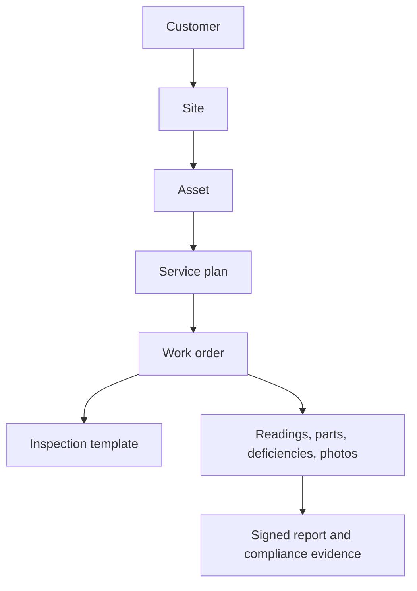

# Voltcore FieldOps — Expansion & Efficiency Roadmap

## Purpose

Voltcore began as an offline-first field inspection and maintenance application
for standby-generator compliance. Its existing foundations—tenant-aware access,
Hive-first persistence, durable sync, scheduling, equipment history, photos,
signatures, PDF reporting, and notifications—make it a strong base for a wider
field-service and compliance product.

The target is **Voltcore FieldOps**: a system for managing physical assets,
recurring service, inspections, work orders, deficiencies, and compliance
evidence across electrical and facilities equipment. Generator workflows remain
supported as the first template pack; this is an additive evolution, not a
rewrite.

## Recommended market focus

Start with **Electrical Critical Systems**. It has the closest operational fit
to the current product and to A&S Electric's work while supporting a broader
customer offering.

| Priority | Asset/service area | Why it fits |
| --- | --- | --- |
| 1 | ATS / transfer switches | Already adjacent to generator inspections and load testing. |
| 2 | Switchgear, panels, breakers, transformers | Reuses inspection, readings, deficiencies, and planned-service workflows. |
| 3 | Emergency lighting and exit signs | High-volume recurring compliance work and route scheduling. |
| 4 | UPS and battery systems | Uses the same asset, reading, maintenance, and evidence model. |
| 5 | EV chargers | A growing electrical-service category with clear preventive-maintenance needs. |
| 6 | Solar and battery-energy storage | A later extension after electrical templates and work orders mature. |
| 7 | General facilities assets | HVAC, pumps, refrigeration, and fire-safety systems after the generic core is proven. |

## Product core

The reusable data concepts are:

- **Customers and sites**: commercial customers may have many service sites.
- **Assets**: make, model, serial, location, criticality, status, QR/barcode,
  commissioning/warranty dates, tags, and type-specific metadata.
- **Asset types**: Generator, transfer switch, switchgear, panelboard,
  transformer, emergency lighting, UPS, EV charger, energy storage, and other.
- **Inspection templates**: versioned checklists with validation, required
  evidence, signatures, scoring, and report layouts.
- **Service plans and work orders**: scheduled by time, meter reading, or an
  inspection result; with assignment, lifecycle state, labor, and materials.
- **Deficiencies and readings**: severity, owner, due date, resolution; plus
  voltage, amperage, runtime, battery state, temperature, and test results.
- **Documents and parts**: customer-ready reports, photos, permits, manuals,
  truck stock, material use, and reorder thresholds.

Use a stable generic asset record plus structured `metadata` for
asset-type-specific values. Do not build a new hardcoded Dart entity and form
for every equipment category. Preserve the existing detailed generator record
and PDF as a template-specific payload during the migration.

## Efficiency priorities

1. **Tenant-safe data first.** Every operational table must be scoped to a
   validated tenant and governed by separate SELECT/INSERT/UPDATE/DELETE RLS
   policies. Do not use authenticated-wide `USING (true)` access.
2. **One authoritative asset registry.** Keep inspection-derived discovery as
   a convenience, but allow a manually entered asset to exist before its first
   inspection.
3. **Template-driven forms and PDFs.** One renderer and reporting boundary
   should serve every asset type.
4. **Team-safe synchronization.** Keep local-first behavior, then add pull
   cursors, revision checks, and supervisor-visible conflict handling.
5. **Test the common core.** Prioritize RLS, mappers, sync, offline retries,
   template rendering, and work-order transition tests before multiplying
   vertical-specific workflows.

## Delivery sequence

### Phase 1 — Secure foundation and generic asset vocabulary

**Objective:** make scheduling tenant-safe and make the shared equipment table
able to represent non-generator assets without disrupting existing generator
records.

- Convert scheduling from authenticated-wide access to tenant-membership RLS.
- Require a UUID-shaped tenant ID for new or updated scheduled tasks; preserve
  legacy rows without guessing their owner, and re-home them explicitly.
- Ensure `authenticated` receives explicit Data API grants because newer
  Supabase projects can opt out of automatic public-schema exposure.
- Add `asset_type`, `metadata`, and optional `site_id` to the equipment
  registry. Existing rows default to `generator`.
- Add Dart `AssetType` support and mapper coverage while retaining the present
  generator-derived registry and UI.

**Exit criteria:** no tenant can read or write another tenant's scheduled task;
new schedule writes carry a real tenant ID; a remote registry row can describe
an ATS or another supported asset type.

### Phase 2 — Sites, assets, and work orders

- Add customer-to-site ownership and a dedicated asset creation/edit path.
- Introduce work-order lifecycle, assignments, priorities, and asset links.
- Add QR/barcode lookup and asset history.

**Customer/site foundation:**
`supabase/migrations/20260822205219_phase2_customer_sites.sql`
adds a tenant-owned customer directory and an optional customer link on the
existing service-site table. It does not guess customer ownership for legacy
sites. `20260822205311_phase2_customer_site_grants.sql` brings already-deployed tables
to the same authenticated-only, no-delete grant policy used by fresh installs.
Customer and site creation/editing is restricted to dispatch, supervisory, and
administrator tenant roles; all active tenant members may read the directory.

### Phase 3 — Template engine and generator migration

- Add template definitions, revisions, fields, validation, and structured
  responses.
- Render generator inspection/maintenance forms and reports from the engine
  while retaining legacy report compatibility.

### Phase 4 — First electrical template packs

- Ship ATS/switchgear and emergency-lighting workflows.
- Add recurring routes, deficiencies, readings, and customer-ready reports.

### Phase 5 — Operations and commercial tools

- Add parts and truck inventory, estimates/approvals, customer portal, and
  asset reliability dashboards.

### Phase 6 — Further vertical expansion

- UPS, EV charging, energy storage, solar, and selected facilities categories.

## Phase 1 implementation notes

The phase is implemented through `supabase/migrations/0006_phase1_asset_foundation.sql`
and the equipment/schedule mapping layer. Apply the migration only after the
tenant bootstrap (`supabase/manual/tenant_bootstrap.sql`) is complete. The database currently contains a legacy schedule
row whose tenant membership cannot be verified; the migration intentionally
keeps it inaccessible until an administrator re-homes it rather than assigning
it to a guessed tenant.

After migration:

1. Run the migration in a staging Supabase project.
2. Verify that `public.tenants` contains the active tenant and that every user
   has an active `tenant_members` row.
3. Re-home legacy schedule rows with the commented SQL in the migration.
4. Confirm an authenticated user can read and write only their tenant's task.
5. Run the Flutter mapper and repository tests before production rollout.

## Guardrails

- Never put service-role credentials in the Flutter app.
- Treat client-selected roles as a UI preference only; authorization comes from
  `tenant_members` and RLS.
- Keep existing generator data compatible until a verified data migration and
  rollback plan exist.
- Do not automatically associate legacy tenantless records with a tenant.
