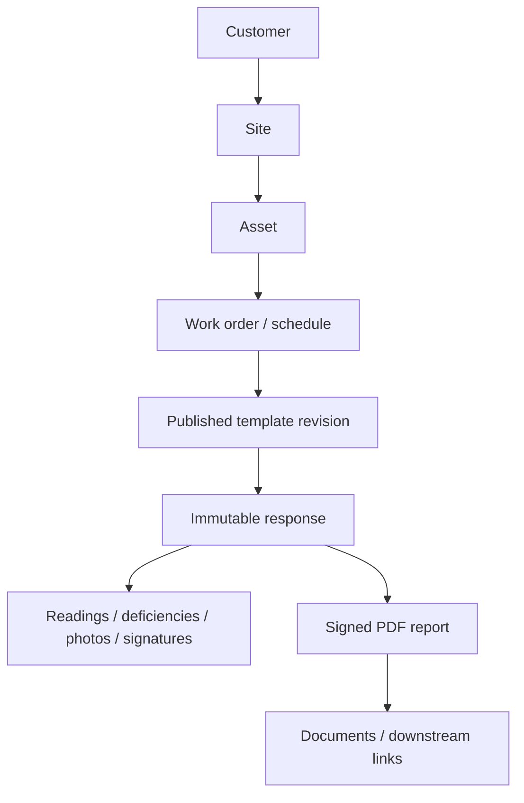

# Voltcore FieldOps — Expansion & Efficiency Roadmap

## Purpose

Voltcore began as an offline-first standby-generator inspection and maintenance application. The FieldOps roadmap expands that foundation into a reusable, tenant-safe field-service and compliance platform for customers, sites, assets, work orders, inspections, maintenance, evidence, signed reports, operational tooling, and additional service verticals.

Generator workflows remain the first supported vertical and the regression baseline. Phase 3 is additive: it does not delete or rewrite legacy generator records or reports.

For the detailed Phase 3 closeout checklist and staged retention-enforcement design, see [`voltcore_phase3_onward_and_retention_action_plan.md`](voltcore_phase3_onward_and_retention_action_plan.md).

## Product core



## Delivery status — 3 September 2026

| Phase | Status | Delivered scope | Remaining gate |
| --- | --- | --- | --- |
| Phase 1 | Complete | Tenant-safe scheduling, generic asset vocabulary, local-first persistence, durable sync conventions. | Environment-by-environment operational verification only. |
| Phase 2 | Complete / rollout validation | Customer/site directory, generic asset registration, work-order lifecycle, schedule details, audit events, dispatch views, maintenance handoff. | Continue real-user rollout verification. |
| Phase 3 | Automated implementation complete / manual pilot pending | Versioned templates, management UI, generic renderer, offline response lifecycle, generator packs/adapters, generic PDFs, Documents integration, report links, technician runtime, RBAC/settings hardening. Generator inspection and maintenance revision 1 are installed/published in A&S Electric. | Start the controlled inspection/maintenance pilot, then complete offline/restart, PDF parity, sync, exact-revision, and rollback certification. |
| Phase 4 | Planned | First reusable electrical template packs. | Begins only after Phase 3 pilot signoff. |
| Phase 5 | Planned | Operations and commercial tooling. | Follows Phase 4 foundation. |
| Phase 6 | Planned | Additional service verticals. | Follows stabilization of earlier phases. |

## Phase 1 — Secure foundation and generic asset vocabulary

Delivered:

- tenant-scoped scheduling and authenticated Data API access;
- shared equipment records capable of representing non-generator assets;
- asset type and metadata mapping;
- local-first persistence and durable synchronization conventions.

## Phase 2 — Sites, assets, and work orders

Delivered:

- customer-to-site ownership and directory UI;
- site-aware generic asset registration/reassignment;
- QR/barcode search and asset history;
- work-order create/edit/list/detail and one-way lifecycle transitions;
- technician assignment, priority, schedule, customer/site/asset links;
- database-owned audit events;
- schedule-task detail routing before source navigation;
- operational workload summary;
- inspection-to-maintenance scheduling handoff;
- legacy maintenance-record/archive access.

### Schedule deletion consistency

PR #52 fixed a race where a stale remote schedule GET could rehydrate a task after its DELETE succeeded. Deletion tombstones now live at the shared repository boundary, so deleted tasks stay absent from Upcoming, Dashboard activity, stats, calendar/list/timeline views, and detail until the same ID is intentionally saved again.

## Phase 3 — Template engine and generator migration

### Objective

Replace generator-specific form/PDF branching with a versioned, tenant-safe engine while preserving every existing generator record/report throughout controlled cutover and rollback.

### Delivered architecture

#### Template/data contract

Delivered entities:

- `form_templates`
- `form_template_revisions`
- `form_template_sections`
- `form_template_fields`
- `form_template_field_options`
- `form_responses`
- `form_response_report_artifacts`

Responses store the exact template revision used. Completed responses are immutable. Report artifacts derive tenant/revision/customer/site/asset/work-order/inspection/maintenance links from the completed response rather than client-supplied relationship IDs.

#### Template management

Delivered:

- role-gated template list/revision history;
- clone-as-draft;
- draft editor for sections, fields, options, validation, visibility, and order;
- atomic draft graph save;
- atomic publish with replacement archival;
- draft archival;
- idempotent, non-destructive generator template-pack installation.

Template management is available to supervisor, dispatcher, and admin roles. RLS remains authoritative.

#### Generic runtime renderer

Supported field types:

- text;
- number;
- reading with units;
- date;
- select;
- boolean;
- checklist;
- photo;
- signature.

The runtime supports conditional section/field visibility, required/type/range validation, read-only rendering, and pluggable evidence capture.

#### Offline response lifecycle

Delivered:

- local-first response persistence;
- durable sync enqueue;
- debounced autosave;
- serialized saves/retryable errors;
- exact template-revision pinning;
- validation before completion;
- hard mutation lock after completion;
- exact-revision Hive definition cache;
- restart/offline recovery tests;
- no-newer-revision substitution.

#### Generator packs and legacy migration adapters

Canonical packs:

- `generator-inspection`
- `generator-maintenance`

Adapters preserve directly equivalent values, complete JSON-safe `_legacyPayload`, provenance, legacy boolean ambiguity, load-test/photo evidence links, and response state/revision provenance.

#### Generic PDF and Documents path

Delivered:

- exact revision check before rendering;
- Noto Sans / US Letter multi-page output;
- metadata, grade, deficiencies, labels, readings, units, photos/signatures, pagination, provenance;
- native managed-PDF storage;
- web `WebFileStore`/IndexedDB persistence;
- Documents discovery/open/share/delete;
- durable upload enqueue;
- immutable report metadata and downstream lookup indexes.

Legacy generator PDFs remain available as the pilot comparison baseline.

#### Technician execution runtime and rollback

Route:

```text
/field-forms/:templateSlug
```

Pilot flag:

```bash
flutter run -d edge \
  --dart-define=VOLTCORE_GENERATOR_TEMPLATE_PILOT=true
```

or:

```bash
flutter build web \
  --dart-define=VOLTCORE_GENERATOR_TEMPLATE_PILOT=true
```

Without the define, the pilot route is not registered and legacy generator inspection/maintenance routes remain active.

### Phase 3 merged sequence

Core Phase 3 increments:

- #46 — management write boundary / atomic revision RPCs
- #47 — role-gated management UI
- #48 — draft definition editor
- #49 — generic renderer
- #50 — offline autosave / completion locking
- #51 — generator template pack / legacy adapters
- #53 — generic template PDF renderer
- #54 — cross-platform report persistence / Documents
- #55 — durable report artifact links
- #56 — technician runtime pilot / exact-revision cache certification
- #57 — final automated Phase 3 certification / DB index hardening

Supporting hardening delivered afterward:

- #58 — Template Management discoverability and existing Settings wiring
- #59 — password/account controls
- #60 — persisted app settings and operational notification/auto-sync controls
- #61 — cross-platform export / safe cache maintenance
- #62 — tenant-membership-authoritative RBAC management
- #63 — tenant retention-policy settings
- #64 — privacy-aware advanced network logging
- #65 — safe form navigation and Android tooling update
- #66 — stale-tenant queued-sync healing
- #67 — tenant-admin user/role management hardening
- #68 — inspection address normalization, explicit YES/NO presentation, checklist conclusions

PR #52 was the independent schedule-deletion consistency repair.

## Phase 3 certification gate

### Automated/code gates — complete

- [x] `flutter analyze --fatal-infos --fatal-warnings`
- [x] `flutter test`
- [x] `flutter build web`
- [x] generator semantic parity tests
- [x] generic report generation for adapted generator responses
- [x] exact-revision offline cache/restart tests
- [x] report-artifact RLS/trigger verification
- [x] report-artifact index hardening / advisor follow-up
- [x] Template Management discoverability
- [x] tenant-authoritative RBAC/settings hardening
- [x] generator inspection template installed/published in A&S Electric
- [x] generator maintenance template installed/published in A&S Electric

### Manual A&S Electric pilot — remaining

1. Build/run with `VOLTCORE_GENERATOR_TEMPLATE_PILOT=true`.
2. Start the first generator-inspection response while online.
3. Continue work offline and verify autosave.
4. Restart and verify exact revision/value recovery.
5. Complete and verify immutability.
6. Generate/open the customer PDF from Documents.
7. Reconnect and verify response/file sync.
8. Publish a newer template revision.
9. Reopen the completed response and verify it remains pinned to its original revision.
10. Compare the template report against the legacy report for identity/site/address, compliance/checklist answers, conclusions, readings/grade, deficiencies, load-test evidence, signatures/photos, pagination, and readability.
11. Repeat for generator maintenance.
12. Disable the pilot flag and verify legacy workflows/reports remain usable.

**Phase 3 exit criterion:** a technician can complete generator inspection and maintenance offline from published revisions, synchronize safely, produce customer-ready reports, and reopen immutable responses against their original revisions after newer revisions exist, while legacy workflows remain a verified rollback path.

Do not mark Phase 3 production-certified until this manual pilot is signed off.

## Phase 4 — First electrical template packs

After Phase 3 certification:

- ATS / transfer-switch inspection and maintenance;
- switchgear/panel/transformer inspection packs;
- emergency-lighting/exit-sign recurring compliance;
- reusable deficiencies, readings, evidence, and signed reports.

## Phase 5 — Operations and commercial tools

- parts and truck inventory;
- estimates/approvals;
- customer portal;
- reliability and service dashboards.

## Phase 6 — Further vertical expansion

- UPS;
- EV charging;
- energy storage/solar;
- selected facilities assets;
- additional tenant-configurable packs.

## Retention enforcement track

The tenant retention-policy UI is implemented, but destructive enforcement remains disabled. Archive and deletion eligibility are intentionally separate concepts. The staged plan is:

1. **Safe preview:** eligibility engine, holds, evidence manifests, retention queue; no deletion.
2. **Controlled disposition:** grace period, pending-purge state, dry-run worker, frozen manifest/audit.
3. **Certified purge:** begin with archived maintenance jobs only, storage cleanup before database cleanup, idempotent retry, audit, metrics, and explicit enablement.

See [`voltcore_phase3_onward_and_retention_action_plan.md`](voltcore_phase3_onward_and_retention_action_plan.md) for the full model and guardrails.

## Guardrails

- Never place service-role credentials in Flutter.
- Roles come from `tenant_members`; UI gating cannot replace RLS.
- New routes are default-deny until explicitly registered.
- Never substitute a newer template revision for a pinned response.
- Do not infer missing legacy values during migration.
- Keep legacy generator data and PDFs through pilot/rollback.
- Web file workflows use `WebFileStore`, not filesystem APIs.
- Archive is not delete.
- Destructive retention requires evidence-graph validation, storage-safe execution, audit, and explicit certification.
