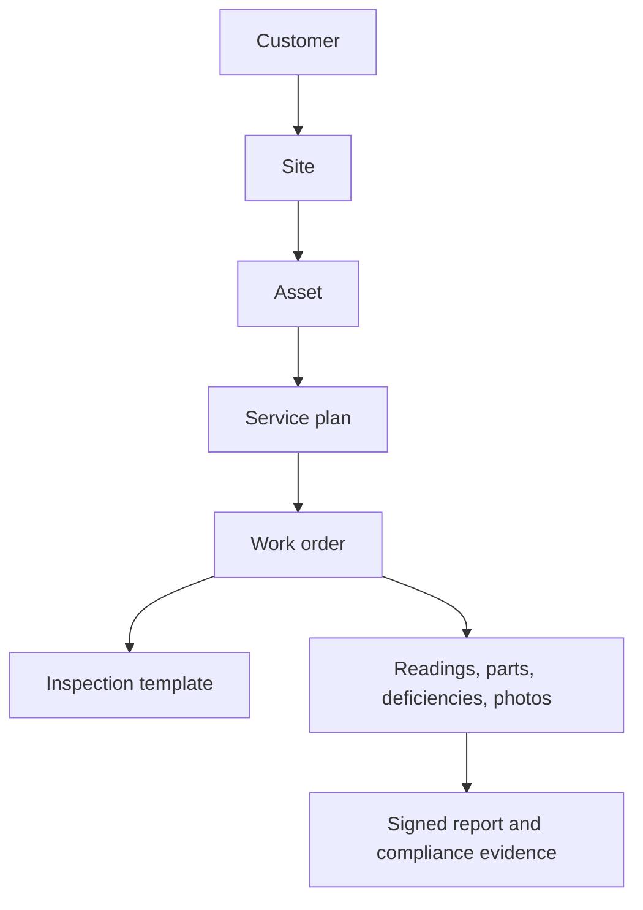

# Voltcore FieldOps — Expansion & Efficiency Roadmap

## Purpose

Voltcore began as an offline-first field inspection and maintenance application
for standby-generator compliance. Its existing foundations—tenant-aware access,
Hive-first persistence, durable sync, scheduling, equipment history, photos,
signatures, PDF reporting, and notifications—make it a strong base for a wider
field-service and compliance product.

The target is **Voltcore FieldOps**: a system for managing physical assets,
recurring service, inspections, work orders, deficiencies, and compliance
evidence across electrical and facilities equipment. Generator workflows remain
supported as the first template pack; this is an additive evolution, not a
rewrite.

## Recommended market focus

Start with **Electrical Critical Systems**. It has the closest operational fit
to the current product and to A&S Electric's work while supporting a broader
customer offering.

| Priority | Asset/service area | Why it fits |
| --- | --- | --- |
| 1 | ATS / transfer switches | Already adjacent to generator inspections and load testing. |
| 2 | Switchgear, panels, breakers, transformers | Reuses inspection, readings, deficiencies, and planned-service workflows. |
| 3 | Emergency lighting and exit signs | High-volume recurring compliance work and route scheduling. |
| 4 | UPS and battery systems | Uses the same asset, reading, maintenance, and evidence model. |
| 5 | EV chargers | A growing electrical-service category with clear preventive-maintenance needs. |
| 6 | Solar and battery-energy storage | A later extension after electrical templates and work orders mature. |
| 7 | General facilities assets | HVAC, pumps, refrigeration, and fire-safety systems after the generic core is proven. |

## Product core

The reusable data concepts are:

- **Customers and sites**: commercial customers may have many service sites.
- **Assets**: make, model, serial, location, criticality, status, QR/barcode,
  commissioning/warranty dates, tags, and type-specific metadata.
- **Asset types**: Generator, transfer switch, switchgear, panelboard,
  transformer, emergency lighting, UPS, EV charger, energy storage, and other.
- **Inspection templates**: versioned checklists with validation, required
  evidence, signatures, scoring, and report layouts.
- **Service plans and work orders**: scheduled by time, meter reading, or an
  inspection result; with assignment, lifecycle state, labor, and materials.
- **Deficiencies and readings**: severity, owner, due date, resolution; plus
  voltage, amperage, runtime, battery state, temperature, and test results.
- **Documents and parts**: customer-ready reports, photos, permits, manuals,
  truck stock, material use, and reorder thresholds.

Use a stable generic asset record plus structured `metadata` for
asset-type-specific values. Do not build a new hardcoded Dart entity and form
for every equipment category. Preserve the existing detailed generator record
and PDF as a template-specific payload during the migration.

## Efficiency priorities

1. **Tenant-safe data first.** Every operational table must be scoped to a
   validated tenant and governed by separate SELECT/INSERT/UPDATE/DELETE RLS
   policies. Do not use authenticated-wide `USING (true)` access.
2. **One authoritative asset registry.** Keep inspection-derived discovery as
   a convenience, but allow a manually entered asset to exist before its first
   inspection.
3. **Template-driven forms and PDFs.** One renderer and reporting boundary
   should serve every asset type.
4. **Team-safe synchronization.** Keep local-first behavior, then add pull
   cursors, revision checks, and supervisor-visible conflict handling.
5. **Test the common core.** Prioritize RLS, mappers, sync, offline retries,
   template rendering, and work-order transition tests before multiplying
   vertical-specific workflows.

## Delivery sequence

### Delivery status — 23 August 2026

| Phase | Status | Delivered scope | Remaining gate |
| --- | --- | --- | --- |
| Phase 1 | ✅ Complete | Tenant-safe schedule foundation, generic asset vocabulary, equipment mapper/repository support, and asset registration. | Apply and verify the migration in each Supabase environment. |
| Phase 2 | 🟡 Merge and rollout validation | Source implementation is complete in PR #41: customer/site directory, site-aware asset registration and reassignment, QR lookup, asset history, work-order operations UI, dispatch workload summary, database sync, and database-owned audit events. | Merge PR #41; complete staging/production migration, tenant/RLS, and real-user workflow verification. |
| Phase 3 | 🟡 Foundation in progress | Versioned template/revision/field/response contract, tenant-safe migration, local response persistence, durable sync enqueue, and mapper coverage are being implemented in the Phase 3 foundation branch. | Merge Phase 2 lifecycle work, apply and verify the new migration, then deliver template management, runtime renderer, generator pack, and generic PDF output. |

### Phase 1 — Secure foundation and generic asset vocabulary — ✅ Complete

**Objective:** make scheduling tenant-safe and make the shared equipment table
able to represent non-generator assets without disrupting existing generator
records.

- ✅ Scheduling uses tenant-membership RLS; new writes require a valid tenant
  UUID and legacy tenantless rows remain inaccessible until explicitly re-homed.
- ✅ The migration grants `authenticated` the required Data API access.
- ✅ `equipment` supports `asset_type`, structured `metadata`, and optional
  `site_id`; existing records default to `generator`.
- ✅ Dart `AssetType`, Supabase mapping, repository synchronization, and
  generic asset registration are in place while preserving generator records.

**Exit criteria:** no tenant can read or write another tenant's scheduled task;
new schedule writes carry a real tenant ID; a remote registry row can describe
an ATS or another supported asset type.

### Phase 2 — Sites, assets, and work orders — 🟡 Rollout validation

- ✅ Customer-to-site ownership with tenant-scoped RLS and a customer/site
  directory UI.
- ✅ Asset registration now supports generic asset types and selection of a
  customer/service site; existing assets can be reassigned to a site.
- ✅ QR/barcode lookup and asset inspection history are available from Asset
  Search, with named-route and RBAC coverage.
- ✅ Work-order domain, status-transition rules, priority, customer, site,
  asset, and assignee fields are persisted locally, merged from Supabase, and
  synchronized through the durable outbox.
- ✅ The All Jobs list, details, create/edit, dispatch assignment, lifecycle
  transitions, inspection handoff, and schedule task detail flow are usable
  without developer tooling.
- ✅ Selecting any schedule row now opens its scheduled-task detail first;
  maintenance and inspection source records remain explicit secondary links,
  preventing a scheduled-task ID from being treated as a maintenance-record ID.
- ✅ `20260823162511_phase2_work_orders.sql` defines tenant-scoped work orders,
  composite customer/site/asset links, least-privilege RLS, sync indexes, and
  trigger-owned creation/status/assignment audit events.
- ✅ Existing jobs show their synchronized, database-owned activity timeline;
  focused mapper and widget coverage protects the audit-history rendering.
- ✅ All Jobs includes an operational queue summary for open, due-today,
  overdue, and unassigned work. Its calculation is unit-tested so terminal
  records cannot inflate active dispatch metrics.
- ✅ Inspection workflows can initiate maintenance scheduling after completion.
- ✅ Customer/site migrations and their grants are included in the consolidated
  `supabase/schema/voltcore_complete_schema.sql` setup script.

**Remaining Phase 2 gates (not additional feature work):**

1. Merge [PR #41](https://github.com/devartblake/volt_core/pull/41) after its
   CI checks pass.
2. Apply the Phase 1 and Phase 2 migrations in staging and production; run
   `supabase/manual/verify_phase2_tenant_rls.sql` with real member and
   cross-tenant UUIDs to verify tenant-isolated RLS for customers, sites,
   equipment, work orders, and read-only audit events.
3. Verify with real tenant users that work-order creation, status/assignee
   changes, offline re-sync, and audit triggers produce the expected rows.
4. ✅ Focused widget coverage now protects scheduled-task routing and the
   details screen. Run the full staging workflow for customer/site selection,
   asset reassignment, work-order dispatch, and remote conflict handling with
   real authenticated accounts before declaring rollout complete.
5. Review real dispatch usage to determine whether the current queue summary
   needs per-technician capacity, SLA, or additional overdue metrics.

**Customer/site foundation:**
`supabase/migrations/20260822205219_phase2_customer_sites.sql`
adds a tenant-owned customer directory and an optional customer link on the
existing service-site table. It does not guess customer ownership for legacy
sites. `20260822205311_phase2_customer_site_grants.sql` brings already-deployed tables
to the same authenticated-only, no-delete grant policy used by fresh installs.
Customer and site creation/editing is restricted to dispatch, supervisory, and
administrator tenant roles; all active tenant members may read the directory.

**Implementation status:** the customer/site directory, asset registration and
site assignment, QR/barcode lookup, and asset history are complete. Work-order
Increment 1 adds the All Jobs list plus create/edit fields for customer, site,
asset, schedule, priority, and notes. Increment 2 adds active-technician
assignment, one-way lifecycle controls (`draft → scheduled → in progress →
completed`, with cancellation), and an inspection-to-maintenance handoff that
creates a scheduled work order from inspection evidence. The remaining Phase 2
work is staging/production verification, end-to-end coverage, and an
evidence-driven operational dashboard.

**Navigation clarification:** “All Jobs” is the new work-order lifecycle. The
existing generator maintenance forms and reports remain under **Maintenance
Records**, and their completed records are nested under **Archived
Maintenance**. Scheduled tasks have their own selectable detail view and may
link back to an inspection or maintenance source record.

### Phase 3 — Template engine and generator migration — 🟡 Foundation in progress

**Objective:** replace generator-specific form and PDF branching with a
versioned, tenant-safe template engine, while preserving every existing
generator record and report during a gradual cutover.

1. **Template contract and schema.** Define template, revision, section,
   field, option, and validation contracts; add tenant-scoped Supabase tables,
   migration, indexes, grants, and RLS. A completed response must point to the
   immutable revision used to create it.
2. **Dart domain and persistence boundary.** Add template/revision/response
   entities, Supabase mappers, Hive adapters, repository interfaces, remote
   merge behavior, and durable-outbox operations. Keep generic response data
   structured rather than embedding renderer-specific values in the UI.
3. **Template management workflow.** Build role-gated create, draft, clone,
   publish, archive, and revision views. Publishing is append-only: an active
   revision cannot be edited in place once a response exists.
4. **Runtime form renderer.** Render sections and standard field types
   (text, number, date, select, boolean, checklist, reading, photo, and
   signature) from a revision. Add conditional visibility, required-field and
   range validation, autosave, offline drafts, and completion locking.
5. **Generator template pack and migration adapter.** Encode the current
   generator inspection and maintenance forms as the first published template
   pack. Map legacy generator records into template responses without guessing
   missing data; retain the legacy payload and template/revision provenance.
6. **Generic report/PDF renderer.** Generate reports from template metadata and
   response snapshots, including current grading, deficiencies, photos,
   signatures, pagination, and Faustina/Noto fallback fonts. Preserve the
   existing generator PDF as a regression baseline during the transition.
7. **Response lifecycle and downstream links.** Link template responses to
   customers, sites, assets, inspections, work orders, maintenance schedules,
   and documents. Ensure completed responses remain readable after a later
   template revision is published.
8. **Quality, rollout, and rollback.** Add unit, mapper, widget, PDF-golden,
   offline-restart, RLS, and migration-parity coverage. Pilot the generator
   pack with a small tenant, compare legacy and template PDFs, then enable the
   new path behind a feature flag with a documented rollback plan.

**Foundation delivered in the Phase 3 branch:** the SQL migration establishes
tenant-scoped template definitions, a template revision pinned by each
response, explicit Data API grants, RLS, indexes, and a database trigger that
rejects edits to completed responses. The Dart layer has matching immutable
entities, Supabase mappers, a Hive response record, and a local-first response
repository that queues writes to the durable sync outbox. The migration is not
applied to a Supabase environment yet; it must be reviewed and deployed after
the Phase 2 lifecycle branch is merged.

**Phase 3 exit criteria:** a technician can complete a generator inspection
offline from a published revision, synchronize it safely, produce a
customer-ready PDF, and open the same immutable response after the template
has been revised; legacy generator reports remain available throughout the
pilot.

### Phase 4 — First electrical template packs

- Ship ATS/switchgear and emergency-lighting workflows.
- Add recurring routes, deficiencies, readings, and customer-ready reports.

### Phase 5 — Operations and commercial tools

- Add parts and truck inventory, estimates/approvals, customer portal, and
  asset reliability dashboards.

### Phase 6 — Further vertical expansion

- UPS, EV charging, energy storage, solar, and selected facilities categories.

## Phase 1 implementation and rollout notes

Phase 1 is implemented through
`supabase/migrations/0006_phase1_asset_foundation.sql` and the
equipment/schedule mapping layer. Phase 2 adds
`20260822205219_phase2_customer_sites.sql`,
`20260822205311_phase2_customer_site_grants.sql`, and
`20260823162511_phase2_work_orders.sql`; fresh environments can use
`supabase/schema/voltcore_complete_schema.sql` as the consolidated setup
script. Apply the tenant bootstrap (`supabase/manual/tenant_bootstrap.sql`)
before operational migrations. Legacy schedule rows whose tenant membership
cannot be verified remain inaccessible until an administrator re-homes them;
the application never guesses an owner.

After migration:

1. Run the migration in a staging Supabase project.
2. Verify that `public.tenants` contains the active tenant and that every user
   has an active `tenant_members` row.
3. Re-home legacy schedule rows with the commented SQL in the migration.
4. Confirm an authenticated user can read and write only their tenant's task.
5. Run Flutter analyzer, mapper/repository tests, and the customer/site and
   work-order tests before production rollout.

## Phase 2 rollout notes

1. Run the three Phase 2 migrations after Phase 1 (or run the
   consolidated schema for a fresh installation).
2. Verify that an administrator, dispatcher, or supervisor can create and edit
   customers and sites, while a technician can read but cannot change them.
3. Register an asset with a selected site, reassign it, scan or search it, and
   confirm its history remains tenant-scoped.
4. Confirm work-order rows retain their customer, site, asset, priority, and
   assignee links through offline restart and synchronization.
5. Confirm direct event inserts are rejected, tenant members can only read
   their own audit rows, and status/assignee updates create audit events.

## Guardrails

- Never put service-role credentials in the Flutter app.
- Treat client-selected roles as a UI preference only; authorization comes from
  `tenant_members` and RLS.
- Keep existing generator data compatible until a verified data migration and
  rollback plan exist.
- Do not automatically associate legacy tenantless records with a tenant.
